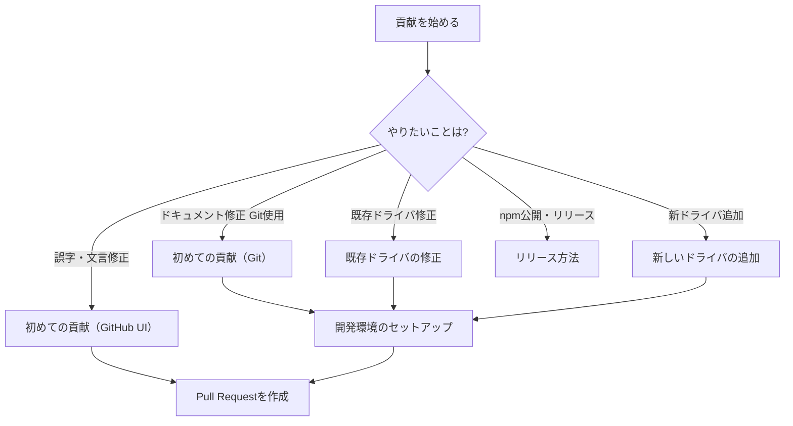



# Contributing Guidelines

[CHIRIMEN Drivers](https://github.com/chirimen-oh/chirimen-drivers) へのコントリビュート方法です。

## はじめに

このリポジトリは、[CHIRIMEN](https://chirimen.org/) で使う IoT デバイスドライバをまとめた **monorepo**（複数パッケージを一つのリポジトリで管理する構成）です。60 個以上のセンサーやモジュール用ドライバが `packages/` 以下にあり、それぞれが npm パッケージ（`@chirimen/デバイス名`）として公開されています。

**このガイドの読み方:** やりたいことに合わせて、下のフローチャートと目次から該当するガイドを選んでください。初めての方は [初めての貢献](docs/contributing/first-contribution.md) から始めることをおすすめします。

## ガイドの選び方

やりたいことに応じて、読むべきガイドが決まります。Git を使う作業はいったん [開発環境のセットアップ](docs/contributing/setup.md) を経てから、それぞれの手順ガイドに進みます。

| フローチャートの項目 | ガイド |
| --- | --- |
| 初めての貢献（GitHub UI） | [初めての貢献](docs/contributing/first-contribution.md) の「方法 A」 |
| 初めての貢献（Git） | [開発環境のセットアップ](docs/contributing/setup.md) → [初めての貢献](docs/contributing/first-contribution.md) の「方法 B」 |
| 既存ドライバの修正 | [開発環境のセットアップ](docs/contributing/setup.md) → [既存ドライバの修正](docs/contributing/fix-driver.md) |
| 新しいドライバの追加 | [開発環境のセットアップ](docs/contributing/setup.md) → [新しいドライバの追加](docs/contributing/add-driver.md) |
| リリース方法 | [リリース方法](docs/contributing/release.md)（メンテナ向け） |
| Pull Request を作成 | 各ガイドの最終ステップ。PR の基本ルールは [はじめに・基本ルール](docs/contributing/getting-started.md) を参照 |

## 目次

### 基本

- [はじめに・基本ルール](docs/contributing/getting-started.md) — 貢献の種類、行動規範、Issues / PR
- [このリポジトリのしくみ](docs/contributing/repository.md) — monorepo の構成とファイル構造

### 手順別ガイド

| やりたいこと | ガイド | 難易度 |
| --- | --- | --- |
| 環境構築・Git の基本 | [開発環境のセットアップ](docs/contributing/setup.md) | 初級 |
| ドキュメント修正 | [初めての貢献](docs/contributing/first-contribution.md) | 初級 |
| 既存ドライバの修正 | [既存ドライバの修正](docs/contributing/fix-driver.md) | 中級 |
| 新しいドライバの追加 | [新しいドライバの追加](docs/contributing/add-driver.md) | 中級〜上級 |

### リファレンス

- [コーディング規約](docs/contributing/coding-standards.md)
- [テストについて](docs/contributing/testing.md)
- [リリース方法](docs/contributing/release.md)
- [よくある質問](docs/contributing/faq.md)
- [付録](docs/contributing/appendix.md) — `package.json` / `index.js` テンプレート

## リリース方法

PR が master にマージされると、GitHub Actions が自動的に npm へパッケージを公開します。手動でリリース作業を行う必要はありません。

バージョン管理の仕組みやメンテナ向けの詳細は [リリース方法](docs/contributing/release.md) を参照してください。
